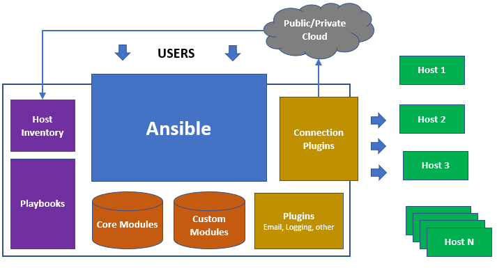

# Ansible 模块 concept
## 模块介绍

Host：由 Ansible 管理的远程计算机。

Group：多个主机分组在一起，共享共同的属性。

Inventory：Ansible 管理的所有主机和组的集合。在简单的情况下可能是静态文件，或者我们可以从远程来源（例如云提供商）提取库存。

Modules：Ansible 发送到远程节点执行的代码单元。

Tasks：将模块及其参数以及其他一些参数组合在一起的操作单元。

Playbooks：任务的有序列表及其必要的参数，定义配置系统的方法。

Roles：基于角色的组织单元，允许用户更轻松地共享自动化代码。

YAML：一种流行且简单的数据格式，非常干净且易于人类理解。



## 1 Inventory 
格式为 .ini  或者 YAML 形式
A basic INI /etc/ansible/hosts might look like this:
```
mail.example.com

[webservers]
foo.example.com
bar.example.com

[dbservers]
one.example.com
two.example.com
three.example.com
```
YAML 格式的文件如下：
```
ungrouped:
  hosts:
    mail.example.com:
webservers:
  hosts:
    foo.example.com:
    bar.example.com:
dbservers:
  hosts:
    one.example.com:
    two.example.com:
    three.example.com:
```

## 2 playbook 是实现具体的功能操作和对应的主机
```
ansible-playbook abc.yaml -i inventory.ini
```
## 3 Tasks一个具体的任务，完成功能的最小单位
```
- name: test when condition
  hosts: localhost
  gather_facts: no

  vars:
    seq:
      - 1
      - 2
      - 3
      - 4

  tasks:
    - name: test loop and when
      debug:
        msg: "{{ item }}"
      with_items: "{{ seq }}"
      when: item >=3
```